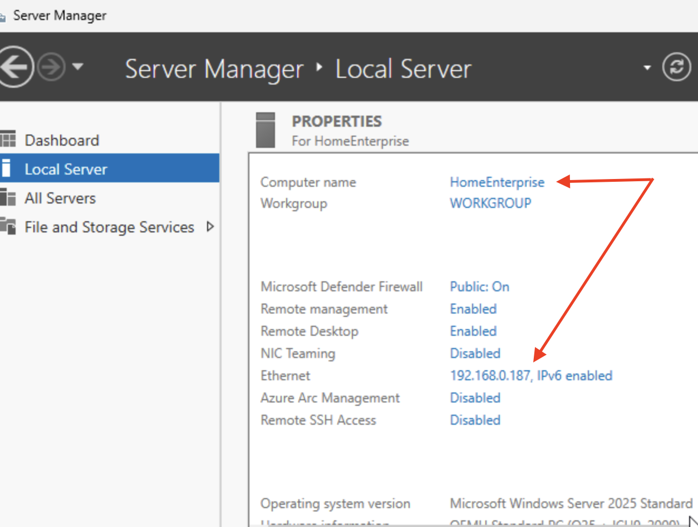
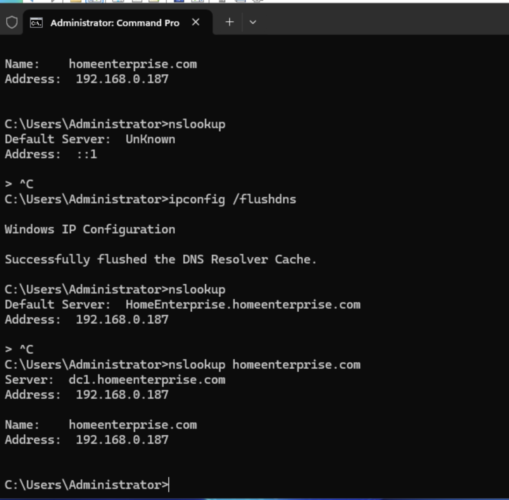

# HomeEnterprise
To setup the HomeEnterprise network, the network is based on proximox and it take this form:

Getting started with the Windows Server 2025 machine requires that the IP address is set to static (aids proper communication to the internet) and a hostname issued to the machine - 

  

## Install Active Directory Domain Service(AD DS) and DNS roles

This phase involves installing the Active Directory domain services (AD DS) role, promoting the server to a Domain Controller (DC) and creating a new domain.

However, before we jump into the installation sequence, it is good to understand certain concept and how they working within the HomeEnterprise network.

#### What is Active Directory(AD)?
Active Directory is a directory service provided by Microsoft that organises and secure network resources, It allows administrators to:

__Centralize management__: AD reduces the complexity of manaaging a network by storing and controlling user data in one place.

__Secure access__: AD uses protocols like kerberos for authentitcation, ensuring only authorised users and devices can connect.

__Simplify resource sharing__: File, printers and applications cann be easily shared withing the domain using AD.

The key features of Active Directory includes:

__Scalability__: AD can manage thousands of objects, making it sutiable for both small businesses and large enterprises.

__Flexibility__: It organizes resources into domains, organizational units(OUs), and forests, giving administrator control over structures and polices.

__Centralised Control__: Administrators can enforce consistent security settings, passwords policies and more across the network.
 

#### What is a Domain Controller (DC)
A Domain controller (DC) refers to a server that runs the Active Directory Domain Service (AD DS) roles and serves as the backbone of your network's identity and access management system.

The DC is responsible for the following:

__Authentication__: Validates users when they log into the domain, Instead of standalone credentials for every machine, a DC ensures that a single, secure username and password words across the network.

__Authorization__: After a user is authenticated, the DC checks their permissions to determine what resources (such as files, printers, applications) they can access.

__Directory Management__: This refers to the maintance of a hierarchical database of all users, computers, and devices in the domain.

__Policy Enforcement__: Applies security settings, user restrictions, and resource access rules through Group Policy.

#### Why Promotes a Server to a Domain Controller?
 Promoting a server to a Domain Controller is a pivotal step because:

  It transforms the server into the central authoriy for identity and access management.
  It allows an administrator to create a domain, a logical grouping of resources, that provides a secure and centralized environment for managing users and devices.
  It lays the foundation for advance features like DNS integration, Group Policy and Active Directory Federation Services (AD FS).

As a side note, creating a new domain helps to establish the first domain in a forest. A forest refers to the top-level strucuture in Active Directory, which can include multiple domains connected by trust relationships.

The video clip below illustrates how the Active Directory Domain Services (AD DS) role, promoting the server to a Domain Controller(DC) and creating a new domain was carried out. 

<table>
  <tr>
    <td>
      
    </td>
    <td>
      <a href="[https://github.com/user-attachments/assets/1ea7f0bf-59bd-400f-986f-c0ac49ca4f95]">
        ▶ Watch Demo Video
      </a>
    </td>
  </tr>
</table>
 
https://github.com/user-attachments/assets/1ea7f0bf-59bd-400f-986f-c0ac49ca4f95
